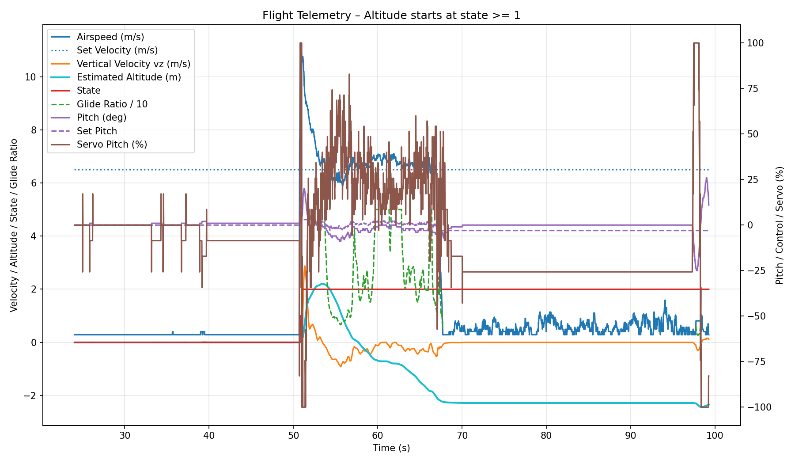

# Team 50: GlideFar
An embedded systems approach to autonomous glider flight.

> NC State ECE senior design project (Team 50, Aug 2025 – May 2026). See [Team](#team) for who built it and [My Contributions](#my-contributions) for my part.

## Description

Our goal was to maximize the flight distance of an autonomous indoor glider. The firmware is written in C on FreeRTOS for the Infineon PSoC™ 6 MCU (CY8CKIT-062S2-AI board). It handles sensing, flight control, servo actuation, serial communication and onboard telemetry logging.

The team also built MATLAB simulations to design the flight controller and Python tools to analyze logged flight data.

## Flight Test

The glider completed an approximately 600 ft flight test. The plot below shows telemetry from one logged test flight, including airspeed, pitch, servo output, estimated altitude and flight state.

## Team

- Akshay Pradhan
- Sanchit Varshney
- Hayden Cameron
- Christian Woodbury
- Matthew Ward

Mentors: Jeremy Edmondson and Mihail Sichitiu. Sponsor: North Carolina State University.

## My Contributions

I worked on the embedded firmware, including the onboard telemetry logging that records each flight for analysis afterward, and on other FreeRTOS tasks.

  

